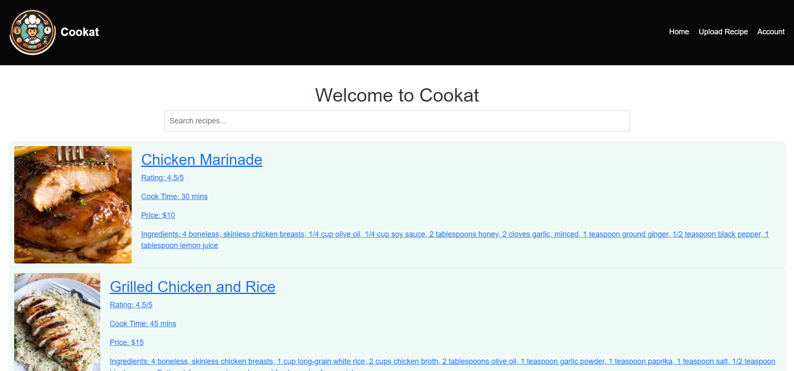
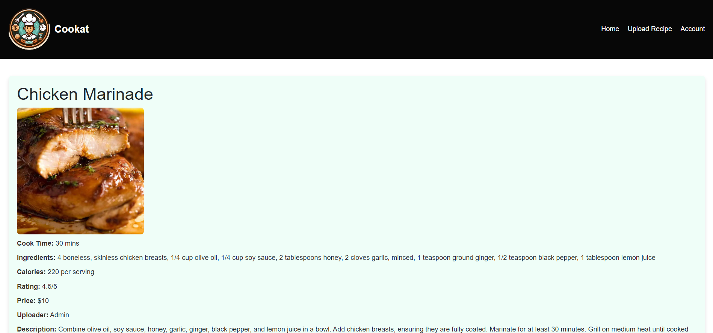
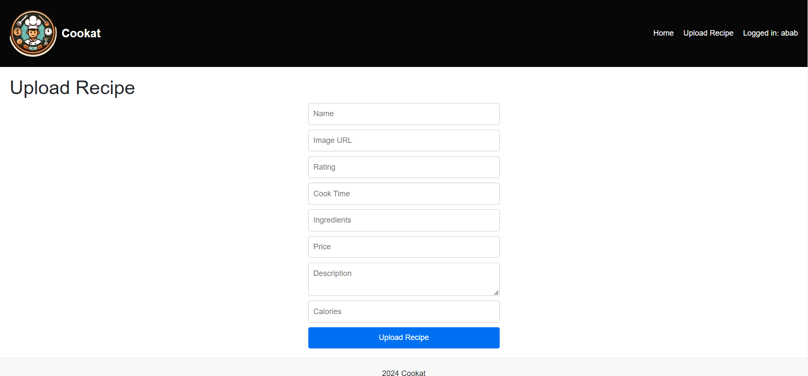

# Cookat

Cookat is a web application designed for users to upload, search, view, and delete recipes. It is built using ReactJS and Next.js with a focus on providing a user-friendly interface for managing recipes.

## Project Description

Cookat allows users to:
- Upload new recipes with detailed information.
- Search for recipes based on recipe names.
- View detailed information about each recipe.
- Delete recipes they have uploaded.
- Sign up and log in to manage their recipes.

## Usage Scenarios

### Scenario 1: Viewing Recipes
1. Navigate to the home page.
2. Use the search bar to find recipes by name or ingredient.
3. Click on a recipe card to view detailed information about the recipe.

### Scenario 2: Uploading a Recipe
1. Log in to your account.
2. Click on the "Upload Recipe" link in the navigation bar.
3. Fill in the recipe details in the form and submit.
4. The new recipe appears on the home page and can be viewed in detail.

### Scenario 3: Deleting a Recipe
1. Log in to your account.
2. Navigate to a recipe you have uploaded.
3. Click the "Delete" button to remove the recipe.

### Screenshots

## Data Management

1. MockAPI.io is used for users,sessions and recipes:
### Users: https://6644200a6c6a656587094591.mockapi.io/users
### Sessions: https://6644200a6c6a656587094591.mockapi.io/sessions
### Recipes: https://66452cfcb8925626f89138a2.mockapi.io/recipes

## Responsibilities of Each Project Member
- I work alone so I did everything.

## How to run
1. Download the project zip file from the repository.
2. Extract the zip file to a directory of your choice.
3. Navigate to the project directory in command prompt
4. npm install
5. npm run dev
6. Navigate to given link (http://localhost:3000)

